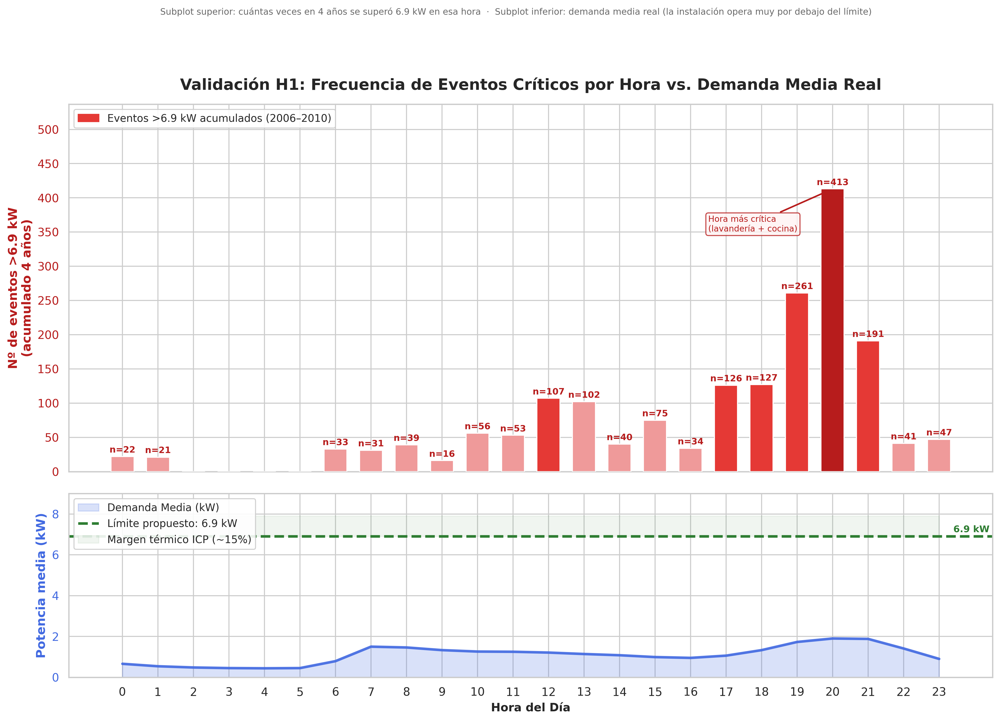
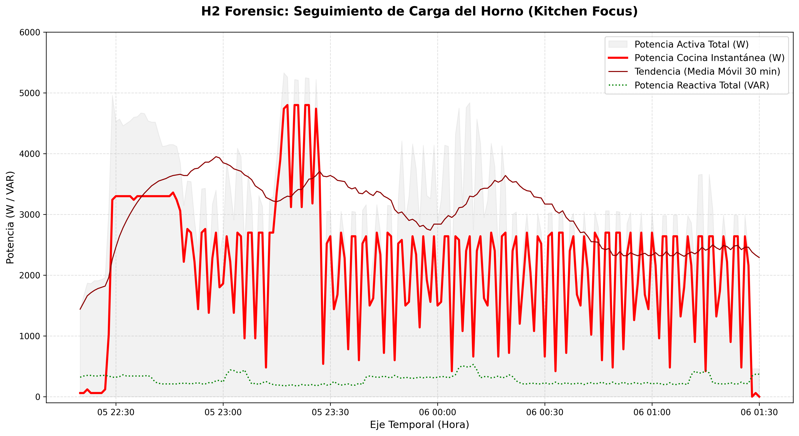
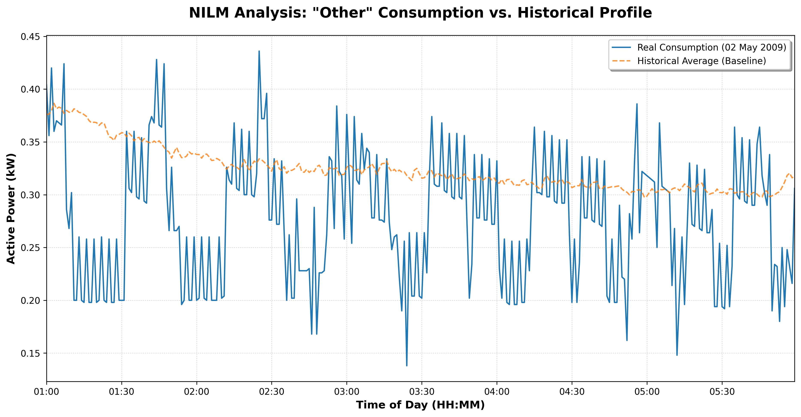
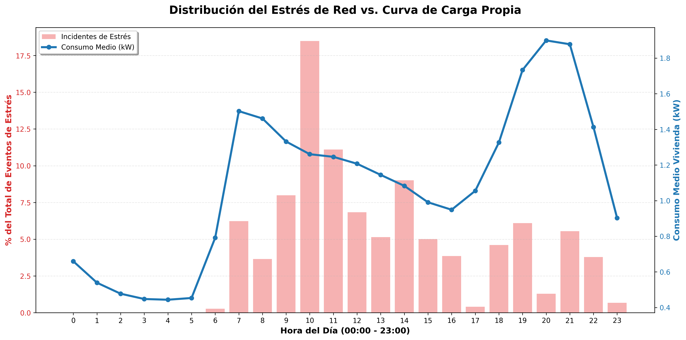
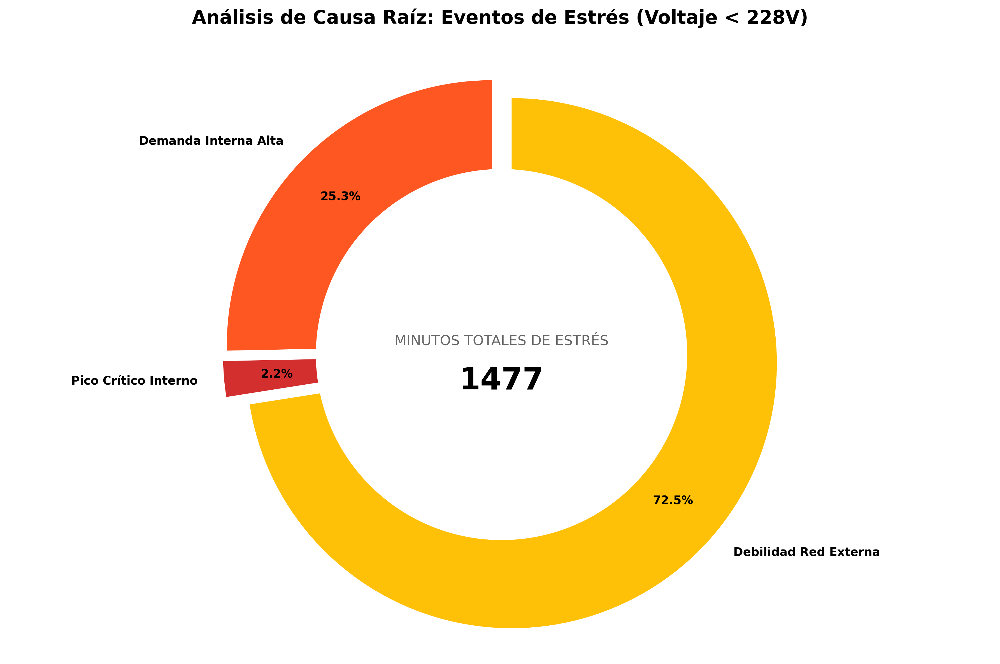

<div align="center">

```
██████╗  ██████╗ ██╗    ██╗███████╗██████╗      █████╗ ██╗   ██╗██████╗ ██╗████████╗
██╔══██╗██╔═══██╗██║    ██║██╔════╝██╔══██╗    ██╔══██╗██║   ██║██╔══██╗██║╚══██╔══╝
██████╔╝██║   ██║██║ █╗ ██║█████╗  ██████╔╝    ███████║██║   ██║██║  ██║██║   ██║
██╔═══╝ ██║   ██║██║███╗██║██╔══╝  ██╔══██╗    ██╔══██║██║   ██║██║  ██║██║   ██║
██║     ╚██████╔╝╚███╔███╔╝███████╗██║  ██║    ██║  ██║╚██████╔╝██████╔╝██║   ██║
╚═╝      ╚═════╝  ╚══╝╚══╝ ╚══════╝╚═╝  ╚═╝    ╚═╝  ╚═╝ ╚═════╝ ╚═════╝ ╚═╝   ╚═╝
```

**Auditoría energética residencial sobre 2 millones de registros mediante Apache Spark**


</div>

---

## Índice

- [El problema](#el-problema)
- [Resultados de un vistazo](#resultados-de-un-vistazo)
- [Las 4 hipótesis](#las-4-hipótesis)
- [Impacto económico](#impacto-económico)
- [Ejecución rápida](#ejecución-rápida)
- [Estructura del proyecto](#estructura-del-proyecto)
- [Documentación técnica](#documentación-técnica)
- [Stack tecnológico](#stack-tecnológico)
- [Sobre el autor](#sobre-el-autor)

---

## El problema

La mayoría de instalaciones residenciales **pagan de más en electricidad** sin saberlo — no por consumir demasiado, sino por ineficiencias que ninguna factura muestra:

- Potencia contratada sobredimensionada para cubrir picos que ocurren el **0,005% del año**.
- Cargas en standby que representan el **37% del consumo** cuando la vivienda duerme.
- Caídas de tensión que degradan silenciosamente los equipos electrónicos.

Las herramientas convencionales (Excel, SQL tradicional) colapsan ante el volumen de datos eléctricos de alta frecuencia. Este proyecto aplica **Apache Spark** sobre 2 millones de registros reales para convertir telemetría bruta en recomendaciones de ahorro con ROI concreto.

---

## Resultados de un vistazo

| Métrica | Valor |
|---|---|
| Registros procesados | 2.075.259 (4 años · muestreo por minuto) |
| Motor | Apache Spark 4.0 · PySpark |
| Tiempo ETL completo | ~17 segundos |
| Almacenamiento | CSV → Parquet/Snappy (reducción >80%) |
| Hipótesis validadas | 4 de 4 · (3 ✅ confirmadas · 1 ⚠️ parcial) |
| **Ahorro proyectado** | **~428 €/año con inversión inicial de ~360 €** |

---

## Las 4 hipótesis

### H1 · Optimización de curva de carga ✅ Validada

**¿Los picos de demanda son estructuralmente necesarios o producto de una mala gestión de cargas?**

El análisis forense de la composición de carga demuestra que los picos (>8 kW) no los genera un único equipo de alta potencia, sino la **coincidencia temporal** de la lavandería (~40% del pico) con la demanda de cocina durante la franja 18:00–22:00. La climatización, inicialmente sospechosa, aporta un ~10% constante y queda exonerada.

**Conclusión:** la potencia contratada puede reducirse de 10,35 kW → **6,9 kW** desplazando únicamente el ciclo de lavado fuera de la franja crítica. Ahorro en término fijo: **inmediato y sin inversión**.

<details>
<summary><b>📈 Ver evidencia — Histórico de picos críticos vs. demanda media real</b></summary>
<br>



> El subplot superior muestra cuántas veces en 4 años se superó el límite de 6,9 kW por franja horaria (máximo: 413 eventos a las 20:00h). El subplot inferior confirma que la demanda media opera muy por debajo del límite — el contrato actual cubre un escenario que casi nunca ocurre.
</details>

---

### H2 · Detección de anomalías estadísticas (regla 3σ) ✅ Validada

**¿Puede Spark identificar eventos de consumo anómalos que no responden a patrones de uso habitual?**

Aplicando **window functions** sobre el histórico horario del circuito de cocina, se detectó un evento el 05/06/2010 a las 23:00h con 4.800W sostenidos — una desviación de 4.742W sobre la media de esa franja (57W). El análisis forense minuto a minuto confirmó el diagnóstico: **horno olvidado encendido durante la madrugada**, funcionando al 83% de la capacidad nominal del circuito (21A de 25A) durante ~3 horas con la cavidad vacía.

**Conclusión:** el patrón de ciclado detectado es la firma eléctrica del termostato del horno — base para implementar un sistema de **apagado automático por NIALM** en entornos Smart Home.

<details>
<summary><b>📈 Ver evidencia — Seguimiento forense de carga del horno</b></summary>
<br>



> La oscilación regular de la línea roja es la firma del termostato manteniendo temperatura en una cavidad vacía. La desconexión manual a las 01:27h descarta cualquier avería mecánica.
</details>

---

### H3 · Consumo residual y eficiencia pasiva ✅ Validada — crítica

**¿El consumo base durante periodos de inactividad supera el umbral de eficiencia del 15%?**

El ratio de standby medido es del **37,66%** — más del doble del umbral planteado. Mediante **análisis NILM** (*Non-Intrusive Load Monitoring*) sobre el circuito "Otros", se aisló una carga cíclica con delta de ~0,24 kW y un **Duty Cycle del 19,78%**: firma característica de un compresor de refrigeración pre-Inverter conectado fuera del circuito de cocina monitorizado (probable arcón o vinoteca).

**Conclusión:** el equipo presenta salud mecánica óptima (Duty Cycle < 25%) pero obsolescencia energética evidente. Su sustitución por tecnología Inverter representa una inversión de capital (CAPEX) justificable, respaldada por el ROI derivado de la reducción directa del consumo base.

<details>
<summary><b>📈 Ver evidencia — Firma NILM: circuito "Otros" vs. perfil histórico</b></summary>
<br>



> La oscilación regular entre 01:00 y 05:30 (sin ocupantes activos) es inconfundible: arranque del compresor → enfriamiento → parada → ciclo. El delta entre picos y valles (~0,24 kW) es consistente con un motor de inducción de la época pre-Inverter.
</details>

---

### H4 · Calidad de suministro y estabilidad de tensión ⚠️ Parcialmente validada

**¿Las caídas de tensión correlacionan con la alta demanda interna o tienen origen en la red de distribución?**

El análisis descarta por completo la instalación interna como causa: la vivienda soporta picos de **11,1 kW manteniendo 229,7V** — sin caídas por impedancia ni puntos calientes. Sin embargo, el **72,5% de los 1.477 minutos de estrés** (<228V) ocurren con cargas internas bajas (~1,7 kW), concentrados entre las 09:00 y las 12:00. La paradoja — peor tensión con menos consumo propio — es la firma de una **saturación externa del transformador de zona** por actividad comercial del entorno.

**Conclusión:** se descarta la inversión en re-cableado. El dataset de 2 millones de registros constituye evidencia documental suficiente para una reclamación técnica formal a la distribuidora bajo el RD 1955/2000.

<details>
<summary><b>📈 Ver evidencia — Distribución del estrés de red vs. curva de carga propia</b></summary>
<br>



> Los picos de estrés (barras rosas) se concentran a las 10:00h, cuando el consumo propio ya está bajando. Una impedancia interna elevada produciría el patrón exactamente inverso.
</details>

<details>
<summary><b>📈 Ver evidencia — Análisis de causa raíz: responsabilidad interna vs. externa</b></summary>
<br>



> El 72,5% de los minutos de estrés se clasifican como debilidad de la red externa. El 2,2% corresponde a picos críticos internos. La instalación no es el problema.
</details>

---

## Impacto económico

> Cálculos sobre tarifa PVPC española 2025: **~60 €/kW·año** en término de potencia · **0,137 €/kWh** en energía (fuente: REE / CNMC). El dataset es de una vivienda en Francia — los hallazgos se extrapolan al mercado tarifario español, contexto de aplicación profesional del análisis.

| # | Acción | Inversión | Ahorro energético | Ahorro €/año | ROI |
|---|---|---|---|---|---|
| H1 | Reducir potencia contratada: 10 kW → 6,9 kW | **€0** *(gestión tarifaria)* | — | **~186 €** *(3,1 kW × 60 €/kW)* | **Inmediato** |
| H3a | Sustituir arcón/vinoteca por tecnología Inverter | **~300 €** | 1.068 kWh/año | **~146 €** | **~2 años** |
| H3b | Smart Kill-Switches en circuitos generales (4× Tapo P110) | **~60 €** | ~700 kWh/año | **~96 €** | **< 1 año** |
| | **TOTAL** | **~360 €** | **~1.768 kWh/año** | **🟢 ~428 €/año** | **< 1 año** |

> Con una inversión única de ~360 €, el sistema se amortiza en menos de 12 meses y genera ~428 €/año de forma recurrente e indefinida. La acción de mayor retorno es el ajuste de potencia contratada: **186 € anuales sin gastar un euro**, simplemente reorganizando el horario de la lavandería.

---

## Ejecución rápida

```bash
git clone https://github.com/aitor-industrial-data/Residential-Power-Audit-Spark-Pipeline.git
cd Residential-Power-Audit-Spark-Pipeline
docker compose up -d --build
```

- **http://localhost:8888?token=audit** → JupyterLab con Spark (token ya configurado)
- **http://localhost:4040** → Spark UI *(disponible durante la ejecución de jobs)*

> El dataset (~132 MB) se descarga automáticamente desde el repositorio oficial de UCI al ejecutar el primer notebook. Si la descarga automática falla, el notebook muestra instrucciones paso a paso para hacerlo manualmente.

Desde el terminal integrado de JupyterLab:

```bash
make run    # ETL → H1 → H2 → H3 → H4 en secuencia
make test   # valida integridad del dato y reproducibilidad de hipótesis
make clean  # elimina cachés y artefactos temporales de Spark
```

Para apagar el entorno y liberar recursos:

```bash
docker compose down      # apaga los contenedores, mantiene los datos
docker compose down -v   # apaga y borra volúmenes (reseteo total)
```

---

## Estructura del proyecto

```
Residential-Power-Audit-Spark-Pipeline/
│
├── 📓 notebooks/
│   ├── 00_ETL_Pipeline.ipynb             # Ingesta, limpieza, feature eng. → Parquet
│   ├── 01_H1_Load_Optimization.ipynb     # Análisis de simultaneidad y curva de carga
│   ├── 02_H2_Anomaly_Detection.ipynb     # Detección de anomalías 3σ + análisis forense
│   ├── 03_H3_NILM_Standby.ipynb          # Consumo residual + desagregación NILM
│   ├── 04_H4_Grid_Quality.ipynb          # Calidad de suministro y estabilidad de tensión
│   └── utils/
│       └── spark_session.py              # Inicialización compartida del motor Spark
│
├── 📊 docs/
│   ├── figures/                          # Gráficos de evidencia exportados por los notebooks
│   └── reports/                          # Documentación técnica del proyecto
│
├── 🗄️ data_storage/
│   ├── source/                           # Dataset original (.txt) — no incluido en repo*
│   └── work/                             # Parquet procesado + reportes CSV
│
├── 🐳 docker/
│   └── Dockerfile                        # Imagen con Spark 3.5 + JupyterLab
│
├── 🔧 src/
│   └── dataset_loader.py                 # Verificación y descarga automática del dataset
│
├── 🧪 tests/
│   └── test_etl.py                       # Validación de volumen, integridad y H3
│
├── docker-compose.yml
├── Makefile                              # Automatización: run · test · clean
├── requirements.txt
└── README.md

* El dataset (~132 MB) se descarga automáticamente desde UCI ML Repository al ejecutar 00_ETL_Pipeline.
```

---

## Documentación técnica

| Documento | Descripción |
|---|---|
| [`00_Data_dictionary.md`](./docs/reports/00_Data_dictionary.md) | Especificaciones técnicas del dataset: variables, unidades, rangos nominales y reglas de calidad |
| [`01_Project_Proposal.md`](./docs/reports/01_Project_Proposal.md) | Marco analítico del proyecto: hipótesis de ingeniería, objetivos técnicos y hoja de ruta |
| [`02_Global_Conclusions.md`](./docs/reports/02_Global_Conclusions.md) | Síntesis ejecutiva: validación de hipótesis, impacto en negocio y plan de acción priorizado |
| [`03_FINAL_REPORT.md`](./docs/reports/03_FINAL_REPORT.md) | Informe técnico pericial completo con evidencia cuantificada por hipótesis |

---

## Stack tecnológico

```
Apache Spark 4.0 (PySpark)       Motor de computación distribuida en memoria
Spark SQL + Window Functions      Análisis estadístico y series temporales
Apache Parquet + Snappy           Almacenamiento columnar optimizado
Python 3.12                       Lógica ETL e ingeniería de características
pytest                            Validación de contratos de calidad del dato
Docker + JupyterLab               Entorno reproducible sin configuración manual
```

**Arquitectura:** patrón Medallón Bronze/Silver · tabla desnormalizada flat para minimizar shuffle · procesamiento in-memory (16 GB driver / 8 GB executor).

---

## Sobre el autor

**Aitor** — Ingeniero Técnico Industrial Eléctrico con 10 años en automatización industrial, diseño eléctrico y sistemas de control. Aplico ese dominio técnico a proyectos de Data Engineering donde el contexto de negocio marca la diferencia entre un análisis correcto y uno útil.

[](https://linkedin.com/in/aitor)
[](https://github.com/aitor-industrial-data)

---

<div align="center">

*Dataset: UCI Individual Household Electric Power Consumption · Sceaux, Francia · 2006–2010 · Licencia CC BY 4.0*  
*DOI: [10.24432/C58K54](https://doi.org/10.24432/C58K54)*

</div>